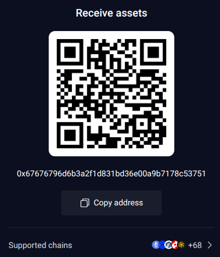
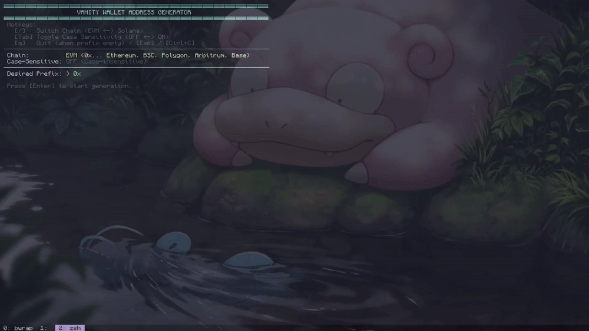

<p align="center">
  
</p>

# evmgen

High-performance, multi-threaded vanity wallet address generator for EVM and Solana blockchains.

Written in Rust. Fully offline, zero disk writes, secure in-memory zeroization upon exit.

<p align="center">
  
</p>

---

## Features

- **Multi-Chain Support**:
  - **EVM**: Generates secp256k1 keypairs, derives Keccak-256 addresses, and computes EIP-55 checksums (`0x...`). Compatible with Ethereum, BNB Chain, Polygon, Arbitrum, Base, Optimism, Avalanche C-Chain, etc.
  - **Solana**: Generates Ed25519 keypairs, computes Base58 addresses and private keys. Compatible with Phantom, Solflare, Backpack, and Solana CLI (`id.json`).
- **Interactive TUI**:
  - Live chain switching (`/`).
  - Case-sensitivity toggle (`Tab`).
  - One-key private key clipboard copy (`y`).
  - Instant cleanup and exit (`q` / `Esc` / `Ctrl+C`).
- **High-Throughput Parallelism**:
  - Distributes workload across all available CPU threads.
  - Batched atomic progress synchronization to eliminate CPU cache-line bouncing.
  - Zero-heap-allocation inner loops using stack buffers for Base58 and hex checks.
- **Security & Zero Footprint**:
  - 100% offline (no networking libraries or outbound connections).
  - Zero file logging or state persistence.
  - Sensitive cryptographic material scrubbed using `zeroize` upon termination.

---

## Performance Notes

Vanity address generation derives raw private keys directly rather than through BIP-39 mnemonic seeds. Deriving addresses through BIP-39 requires PBKDF2-HMAC-SHA512 with 2048 iterations per key, which reduces throughput by ~2000x-5000x. Generated raw private keys can be imported directly into any major wallet (MetaMask, Rabby, Phantom, Solflare).

Prefix difficulty estimates (approximate attempts needed):

| Prefix Length | Combinations (EVM Hex) | Combinations (Solana Base58) |
|---------------|------------------------|------------------------------|
| 3 chars       | ~4,096                 | ~195,112                     |
| 4 chars       | ~65,536                | ~11,316,496                  |
| 5 chars       | ~1,048,576             | ~656,356,768                 |
| 6 chars       | ~16,777,216            | ~38,068,692,544              |

---

## Installation & Setup

### 1. Linux

#### Prerequisites
Install build tools and C compiler:
- **Ubuntu / Debian / Kubuntu / Mint**:
  ```bash
  sudo apt update && sudo apt install -y build-essential curl pkg-config libx11-dev
  ```
- **Arch Linux / Manjaro**:
  ```bash
  sudo pacman -S --needed base-devel curl libx11
  ```
- **Fedora / RHEL**:
  ```bash
  sudo dnf groupinstall "Development Tools" && sudo dnf install libX11-devel
  ```

#### Install Rust
```bash
curl --proto '=https' --tlsv1.2 -sSf https://sh.rustup.rs | sh
source "$HOME/.cargo/env"
```

#### Build & Install Globally
```bash
cargo install --path .
```
Installs binary to `~/.cargo/bin/evmgen` (available in `$PATH`).

#### Run
```bash
evmgen
```
*(Or run local build without installing: `cargo build --release && ./target/release/evmgen`)*

---

### 2. macOS

#### Prerequisites
Install Xcode Command Line Tools:
```bash
xcode-select --install
```

#### Install Rust
```bash
curl --proto '=https' --tlsv1.2 -sSf https://sh.rustup.rs | sh
source "$HOME/.cargo/env"
```

#### Build & Install Globally
```bash
cargo install --path .
```
Installs binary to `~/.cargo/bin/evmgen` (available in `$PATH`).

#### Run
```bash
evmgen
```
*(Or run local build without installing: `cargo build --release && ./target/release/evmgen`)*

---

### 3. Windows

#### Prerequisites
Install **Visual Studio C++ Build Tools**:
Download from [visualstudio.microsoft.com/visual-cpp-build-tools](https://visualstudio.microsoft.com/visual-cpp-build-tools/) and select "Desktop development with C++".

#### Install Rust
Run via PowerShell:
```powershell
winget install Rustlang.Rustup
```
Or download and run `rustup-init.exe` from [rustup.rs](https://rustup.rs). Restart the terminal after installation.

#### Build & Install Globally
From the project directory in PowerShell or Command Prompt:
```powershell
cargo install --path .
```
Installs binary to `%USERPROFILE%\.cargo\bin\evmgen.exe` (available in PATH).

#### Run
```powershell
evmgen
```
*(Or run local build without installing: `cargo build --release` then `.\target\release\evmgen.exe`)*

#### Cross-Compilation for Windows (from Linux)
```bash
rustup target add x86_64-pc-windows-gnu
cargo build --release --target x86_64-pc-windows-gnu
```
Output binary: `target/x86_64-pc-windows-gnu/release/evmgen.exe`

---

## Usage

### Interactive Mode (Default)

Launch the binary without arguments:

```bash
./target/release/evmgen
```

#### Hotkeys:
- **`/`**: Toggle target network between `EVM` and `Solana`.
- **`Tab`**: Toggle case sensitivity (`OFF` = case-insensitive, `ON` = exact character match).
- **`Backspace`**: Delete last character.
- **`Enter`**: Validate prefix and begin multi-threaded search.
- **`q`** or **`Esc`**: Quit setup / abort running search.
- **`y`** (on match): Copy private key to system clipboard.
- **`a`** (on match): Copy public address to system clipboard.
- **`q`** (on match): Wipe memory and exit.

---

### Non-Interactive / CLI Mode

The tool can also be run headlessly or in scripts:

```bash
evmgen --chain <evm|sol> --prefix <PREFIX> [OPTIONS]
```

#### CLI Options:

```text
Options:
  --chain <evm|sol>   Target blockchain (default: evm)
  --prefix <PREFIX>   Target prefix string (hex for EVM, Base58 for Solana)
  --case-sensitive    Enable exact case matching (EIP-55 for EVM, exact Base58 for Solana)
  --threads <N>       Number of worker threads (default: all logical CPU cores)
  -h, --help          Show usage help
```

#### Examples:

Generate EVM address starting with `0xdead`:
```bash
./target/release/evmgen --chain evm --prefix dead
```

Generate Solana address starting with `SOL`:
```bash
./target/release/evmgen --chain sol --prefix SOL --case-sensitive
```

Limit to 4 threads:
```bash
./target/release/evmgen --chain evm --prefix beef --threads 4
```

---

## Wallet Import Guide

- **EVM**:
  1. Open MetaMask / Rabby / Trust Wallet.
  2. Select **Add Account** -> **Import Private Key**.
  3. Paste the 64-character hex string (`0x...`).

- **Solana**:
  1. Open Phantom / Solflare / Backpack.
  2. Select **Add / Connect Wallet** -> **Import Private Key**.
  3. Paste the Base58 private key string.
  4. (For Solana CLI): Save the byte array JSON to `~/.config/solana/id.json`.

---

## License

MIT
